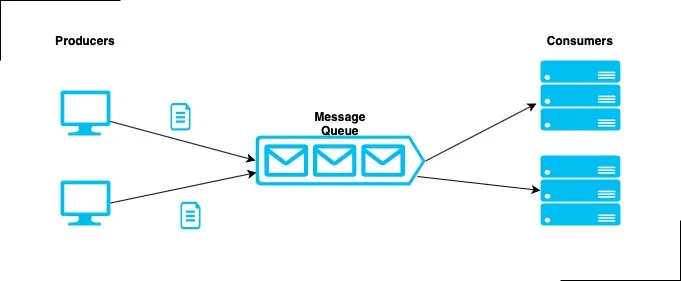
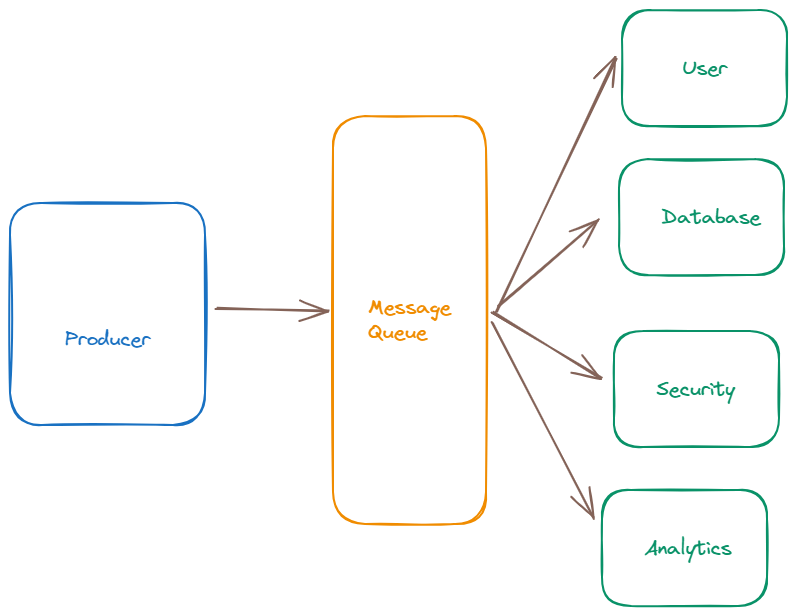

# Kafka

Index

- Introduction
- Message Queue
- Kafka
- Event Driven Architecture

---

Introduction

## Introduction

- In today's world, data plays a crucial role in internet applications.
- Examples: People can generate data in so many ways
  - Page visits and clicks
  - User activities
  - Social networking activities such as likes, shares and comments.
- Kafka is used to handle the realtime data.
- Kafka is a pub/sub model.

### Terminology

- Data: Data can be anything (e.g., JSON, XML, etc.).
- Message: A message is the data.
- Stream: Generates continuously (continuous flow).
- Data stream: If data is generated continuously, it is called a data stream.
- Event Stream: Capturing data continuously.
- Pipe: A pipe acts as a stream (continuous flow) to transform data from one place to another.
- Throughput: It measures the rate at which a system processes data or tasks over a specified period.
- Real-time data: Data generated continuously.

### Example : pub/sub -> publish / subscribe

Imagine you are using a fitness tracker on your wrist. This tracker measures your heart rate every second and sends that data to an app on your phone.

- The continuous heart rate measurements are the data stream.
- The fitness tracker is the producer (it sends the data).
- The app on your phone is the consumer (it receives and processes the data in real-time).

So, as you exercise, the app continuously gets your heart rate data and can immediately show you your current heart rate, average heart rate, or alert you if it gets too high. This is stream processing in action.

---

Message Queue

## Message Queue

- Message Queues are used to manage the Data.
- Message Queue is used to exchange data from one application to another application.
- One application generating the data and another application using the data by using Message queue as a mediator.
- A publish-subscribe messaging system allows a sender to send/write the message and a receiver to read that message. In Apache Kafka, a sender is known as a producer who publishes messages, and a receiver is known as a consumer who consumes that message by subscribing it.
- Without Message Queue we need to establish the pipelines from one application to many application that was very complicated.
- Message Queues is used to solve the complex pipeline.
- Apache Kafka is a Message Queue.
  

### Pipeline

- If send/receive data from one application to another application we need to establish path between them that is called pipeline
- Apache kafka is used solve the complex data pipeline.

---

Kafka

## Kafka

- Apache Kafka is used to handle the real-time data storage. It works as a broker between two parties, i.e., a sender and a receiver.
- Apache Kafka is an open-source stream-processing software platform which is used to handle the real-time data storage.
- Kafka works based on publisher and subscriber model.
- It is a publish-subscribe (pub/sub) messaging system which let exchanging of data between applications, servers, and processors as well.
- Apache Kafka is capable of handling millions of messages per second.
- Kafka is a distributed streaming platform.
- Kafka was originally developed at LinkedIn, then donated to Apache.
- Now it is maintained by Apache.

### why kafka

- Apache Kafka helps solve the slow problem of data communication between a sender and a receiver by acting like a high-speed message bus.
- Apache kafka is used to process real time data feeds with high throughput and low latency.

### Real-Time Data Pipeline

- Kafka is a realtime data pipeline.
- Apache Kafka is specifically designed to manage real-time data.
- When data is continuously generated, we need to capture it without interruption.
- After capturing the data, it is crucial to analyze it and perform necessary actions.
- Event Streaming is the practice of capturing data in real-time from event sources.
- Sources can be databases, sensors, mobile devices, cloud services, and software applications.
- Using event streams we can keep right information at right place at right time.

### stream-processing

- Stream processing is the practice of continuously collecting, analyzing, and acting upon data as it flows in real-time. Instead of storing data and then processing it later, stream processing deals with data on the fly, as soon as it is generated.
- As soon as the streams of records occur, it processes it.

### Throughput

It measures the rate at which a system processes data or tasks over a specified period.

### Latency

- Latency refers to the time delay between the sender and receiver.
- low latency means that messages are delivered quickly from the producer to the consumer.

---

Architecture

## Architecture

1. Kafka cluster : A Kafka cluster consists of multiple brokers.
2. Broker : Kafka brokers are individual servers in a kafka cluster that store data and handle data requests. The brokers array in the code specifies the addresses of Kafka brokers.
3. Topic : A topic consists of multiple partitions. A topic is a category or feed name to which records are published. It's like a named inbox. Topic is used to store the messages.
4. Partition : Each partition can be hosted on different brokers.A topic is divided into partitions for better performance and scalability.

5. Producers: Applications that publish messages to Kafka topics.
6. Consumers: Applications that subscribe to topics and consume records.
7. Consumer Groups: A group of consumers that share a single view of a topic. Each message in a partition is consumed by only one consumer in a group.
8. When you produce or consume messages, Kafka distributes these messages across different partitions and brokers.
9. Producers send messages to Kafka, which distributes these messages across multiple partitions and brokers.
10. Consumers in a consumer group read from different partitions, enabling parallel processing and fault tolerance.
11. The distribution is managed by Kafka internally, and the kafkajs code interacts with this distributed system by connecting to the brokers and handling messages as they are distributed across partitions.

### Apache kafka core API's

- Connector API: Connects Kafka with external data sources.
- Producer API: Sends data to Kafka topics.
- Consumer API: Reads data from Kafka topics.
- Streams API: Processes data within Kafka.

### Kafka flow

- Kafka is a Event driven Architecture.
- Create Topics : Topic is nothing but bucket in the message Queue.
  

---

Installation

## Installation

1. Install Zookeeper : It is going to provide the platform to run the Apache kafka server.
2. Install Apache kafka server
3. Create Topic in Apache-server : Topic is nothing but bucket in the message Queue.

## Prerequisite

- Tools
  - Node.js: [Download Node.JS](https://nodejs.org/en)
  - Docker: [Download Docker](https://www.docker.com)
  - VsCode: [Download VSCode](https://code.visualstudio.com)

### docker-compose

---

Documentation

## Documentation

- Visualization : [https://softwaremill.com/kafka-visualisation/]
- Kafka UI : [https://github.com/provectus/kafka-ui?tab=readme-ov-file]
- Kafkajs : [https://kafka.js.org/docs/getting-started]

---
